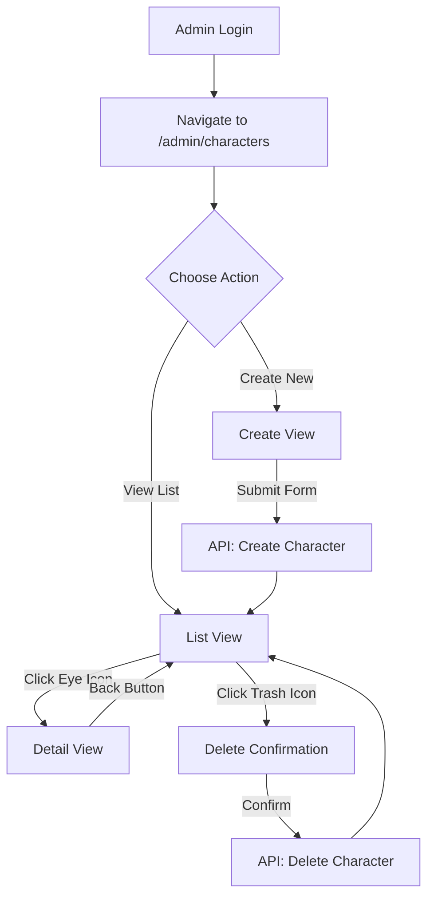

# 🎭 Hướng Dẫn Quản Lý Nhân Vật (Character Management)

## 📋 Tổng Quan

Tính năng **Character Management** cho phép admin quản lý các nhân vật trong các theme của shop. Tất cả các chức năng được tích hợp trong một trang duy nhất với 3 view khác nhau:

- **List View**: Danh sách tất cả nhân vật
- **Detail View**: Xem chi tiết một nhân vật
- **Create View**: Tạo nhân vật mới

## 🚀 Truy Cập Tính Năng

### URL

```
http://localhost:5173/admin/characters
```

### Navigation

- Từ Header admin: Click vào **"Characters"**
- Hoặc truy cập trực tiếp qua URL

## ✨ Các Chức Năng Chính

### 1. 📜 Danh Sách Nhân Vật (List View)

#### Thống Kê

- **Tổng Nhân Vật**: Hiển thị tổng số nhân vật trong hệ thống
- **Số Theme**: Hiển thị tổng số theme có trong hệ thống

#### Bộ Lọc & Tìm Kiếm

- **Tìm kiếm**: Tìm theo tên hoặc mô tả nhân vật
- **Lọc theo Theme**: Chọn một theme cụ thể hoặc xem tất cả

#### Bảng Danh Sách

Hiển thị thông tin:

- ✅ Ảnh nhân vật
- ✅ Tên nhân vật
- ✅ Theme liên kết
- ✅ Mô tả (rút gọn)
- ✅ Thứ tự hiển thị
- ✅ Trạng thái (Hoạt động/Không hoạt động)
- ✅ Hành động (Xem chi tiết, Xóa)

#### Phân Trang

- 10 nhân vật mỗi trang
- Nút "Trước" và "Sau" để chuyển trang
- Hiển thị trang hiện tại và tổng số trang

### 2. 🔍 Chi Tiết Nhân Vật (Detail View)

Khi click vào icon **"Xem chi tiết"** (Eye icon), trang sẽ chuyển sang Detail View hiển thị:

#### Thông Tin Cơ Bản

- 🖼️ **Ảnh Nhân Vật**: Ảnh full size của nhân vật
- 📝 **Tên**: Tên nhân vật
- 🎨 **Theme**: Tên theme mà nhân vật thuộc về
- 🔢 **Thứ tự**: Thứ tự hiển thị
- ⚡ **Trạng thái**: Hoạt động hoặc Không hoạt động
- 📄 **Mô tả**: Mô tả đầy đủ về nhân vật

#### Thời Gian

- 📅 **Tạo lúc**: Ngày giờ tạo nhân vật
- 🔄 **Cập nhật lúc**: Ngày giờ cập nhật cuối cùng

#### Hành Động

- **Quay Lại**: Quay về danh sách nhân vật

### 3. ➕ Tạo Nhân Vật Mới (Create View)

Khi click vào nút **"Tạo Nhân Vật Mới"**, form tạo mới xuất hiện với các trường:

#### Trường Bắt Buộc (\*)

- **Ảnh Nhân Vật** (\*):
  - Click vào khu vực upload để chọn ảnh
  - Hỗ trợ: PNG, JPG, GIF
  - Kích thước tối đa: 5MB
  - Preview ảnh sau khi chọn
  - Có thể xóa và chọn lại
- **Tên Nhân Vật** (\*):
  - Nhập tên nhân vật
  - Ví dụ: "Luke Skywalker", "Batman", "Spider-Man"
- **Theme** (\*):
  - Chọn theme từ dropdown
  - Danh sách hiển thị tất cả theme có trong hệ thống

#### Trường Tùy Chọn

- **Mô Tả**:

  - Mô tả chi tiết về nhân vật
  - Textarea với 4 dòng
  - Ví dụ: "Nhân vật chính trong Star Wars, người mang sứ mệnh Jedi..."

- **Thứ Tự Hiển Thị**:

  - Số nguyên (mặc định: 0)
  - Quyết định vị trí hiển thị của nhân vật
  - Số càng nhỏ càng hiển thị trước

- **Trạng Thái Hoạt Động**:
  - Checkbox (mặc định: checked)
  - Bật: Nhân vật sẽ hiển thị trên website
  - Tắt: Nhân vật bị ẩn

#### Nút Hành Động

- **Hủy**: Quay về danh sách (không lưu)
- **Tạo Nhân Vật**: Lưu và tạo nhân vật mới

### 4. 🗑️ Xóa Nhân Vật

- Click vào icon **"Xóa"** (Trash icon) trong bảng danh sách
- Xuất hiện popup xác nhận
- Nhấn "OK" để xóa hoặc "Cancel" để hủy
- Sau khi xóa thành công, danh sách tự động refresh

## 🔌 API Endpoints Sử Dụng

### Theme APIs

```typescript
GET  /api/themes                     // Lấy danh sách theme
GET  /api/themes/:themeId/characters // Lấy nhân vật theo theme
```

### Character APIs

```typescript
GET    /api/themes/characters/:id           // Lấy chi tiết nhân vật
POST   /api/themes/:themeId/characters      // Tạo nhân vật mới
DELETE /api/themes/characters/:id           // Xóa nhân vật
```

## 📦 Files Liên Quan

### Frontend

```
client/src/
├── pages/
│   └── AdminCharacterManagement.tsx    # Component chính
├── api/
│   └── theme.ts                        # API client
├── router/
│   └── AppRouter.tsx                   # Route config
├── components/common/
│   └── Header.tsx                      # Navigation menu
└── styles/
    └── AdminThemeManagement.css        # Shared CSS
```

### Backend

```
server/
├── models/
│   ├── ThemeCharacter.js              # Character model
│   └── Theme.js                        # Theme model
├── controllers/
│   └── themeController.js             # Character controllers
└── routes/
    └── themeRoutes.js                 # Character routes
```

## 🎨 Giao Diện

### Màu Sắc Badge

- **🟢 Hoạt động**: Badge màu xanh lá
- **🔴 Không hoạt động**: Badge màu đỏ

### Icons Sử Dụng

- 🎨 `Palette`: Icon quản lý nhân vật
- ➕ `Plus`: Tạo mới
- 👁️ `Eye`: Xem chi tiết
- 🗑️ `Trash2`: Xóa
- 🔍 `Search`: Tìm kiếm
- 🖼️ `ImageIcon`: Upload ảnh
- ⬅️ `ArrowLeft`: Quay lại
- 📅 `Calendar`: Thời gian
- 👤 `User`: Thông tin người dùng

## 🔒 Bảo Mật

- **Authentication**: Yêu cầu đăng nhập
- **Authorization**: Chỉ admin và employee có quyền truy cập
- **Middleware**: `requireAuth`, `requireRole("admin", "employee")`

## 💡 Tips & Best Practices

### 1. Đặt Tên Nhân Vật

- ✅ Rõ ràng, dễ hiểu
- ✅ Không trùng lặp trong cùng theme
- ✅ Viết hoa chữ cái đầu

### 2. Upload Ảnh

- ✅ Chọn ảnh chất lượng cao
- ✅ Tỷ lệ khung hình nhất quán
- ✅ Nền trong suốt hoặc thống nhất
- ✅ Kích thước tối ưu: 500x500px
- ❌ Tránh ảnh mờ hoặc quá nhỏ

### 3. Thứ Tự Hiển Thị

- Sử dụng số 0, 1, 2, 3... cho thứ tự tăng dần
- Nhân vật quan trọng nên có số thứ tự nhỏ hơn
- Giữ khoảng cách giữa các số (ví dụ: 10, 20, 30) để dễ chèn sau này

### 4. Mô Tả

- Viết mô tả ngắn gọn, súc tích
- Đề cập đến vai trò hoặc đặc điểm nổi bật
- Độ dài khuyến nghị: 100-200 ký tự

### 5. Trạng Thái

- Chỉ set "Hoạt động" cho nhân vật đã sẵn sàng hiển thị
- Có thể tạo trước và set "Không hoạt động" để chuẩn bị

## 🐛 Xử Lý Lỗi

### Lỗi Thường Gặp

1. **"Vui lòng nhập tên nhân vật"**

   - Nguyên nhân: Trường tên bị bỏ trống
   - Giải pháp: Nhập tên trước khi submit

2. **"Vui lòng chọn theme"**

   - Nguyên nhân: Chưa chọn theme
   - Giải pháp: Chọn theme từ dropdown

3. **"Vui lòng chọn ảnh nhân vật"**

   - Nguyên nhân: Chưa upload ảnh
   - Giải pháp: Click vào khu vực upload và chọn file ảnh

4. **"Không thể tải danh sách nhân vật"**

   - Nguyên nhân: Lỗi server hoặc mạng
   - Giải pháp: Kiểm tra kết nối, refresh trang, hoặc liên hệ admin

5. **"Không thể tạo nhân vật"**
   - Nguyên nhân: Dữ liệu không hợp lệ hoặc lỗi server
   - Giải pháp: Kiểm tra lại form, đảm bảo file ảnh hợp lệ

## 📝 Quy Trình Sử Dụng

### Tạo Nhân Vật Mới

```
1. Đăng nhập với tài khoản admin/employee
2. Navigate đến /admin/characters
3. Click "Tạo Nhân Vật Mới"
4. Upload ảnh nhân vật
5. Điền tên nhân vật
6. Chọn theme
7. Điền mô tả (optional)
8. Set thứ tự (optional)
9. Check/uncheck trạng thái
10. Click "Tạo Nhân Vật"
11. Nhận thông báo thành công
12. Tự động quay về list view
```

### Xem Chi Tiết Nhân Vật

```
1. Từ list view
2. Click icon "Eye" trên hàng nhân vật muốn xem
3. Xem đầy đủ thông tin
4. Click "Quay Lại" để về list
```

### Xóa Nhân Vật

```
1. Từ list view
2. Click icon "Trash" trên hàng nhân vật muốn xóa
3. Xác nhận trong popup
4. Nhân vật bị xóa và list tự động refresh
```

## 🔄 Workflow Hoàn Chỉnh



## 🎯 Tính Năng Nâng Cao (Future)

- [ ] Chỉnh sửa nhân vật (Edit View)
- [ ] Kéo thả để sắp xếp thứ tự
- [ ] Upload nhiều ảnh cùng lúc
- [ ] Crop và resize ảnh trước khi upload
- [ ] Lọc theo trạng thái (Active/Inactive)
- [ ] Sắp xếp theo các trường khác nhau
- [ ] Export danh sách ra CSV/Excel
- [ ] Bulk actions (xóa nhiều, toggle nhiều)

## 📞 Hỗ Trợ

Nếu gặp vấn đề, vui lòng:

1. Kiểm tra console log trong browser (F12)
2. Kiểm tra server logs
3. Đảm bảo đã login với quyền admin/employee
4. Kiểm tra kết nối mạng và API endpoint

---

**Version**: 1.0.0  
**Last Updated**: 2025-11-01  
**Author**: Development Team
